# Mechanical Engineering Training Projects

This repository includes all the mechanical design and robotics tasks I completed during my training.  
The work covers CAD modeling, real-world object design, assemblies, kinematics calculations, and gear systems.

---

## 1. I-Shape Design

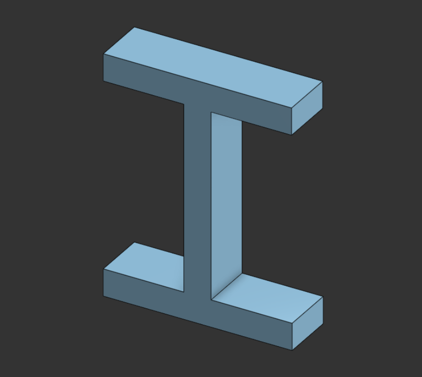

**Description:**  
This model was created as a basic exercise to understand CAD tools and workflow. It focuses on simple geometry and clean structure.

**Key Learning:**  
- Using sketch and extrude tools  
- Understanding dimensions and proportions  
- Building clean and simple models

---

## 2. Flat Washer

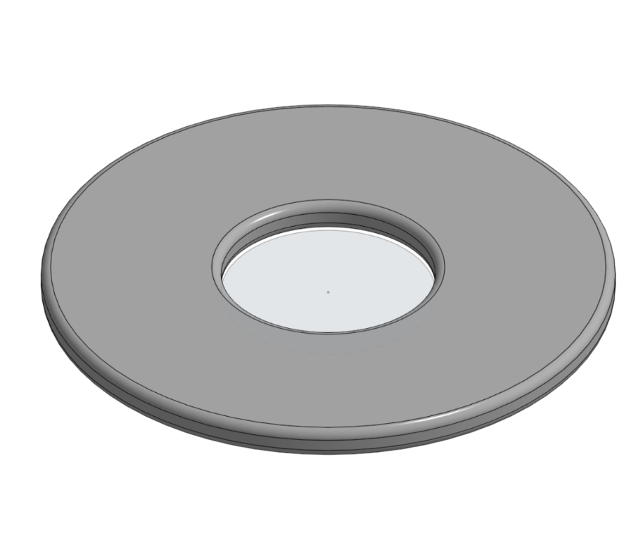  
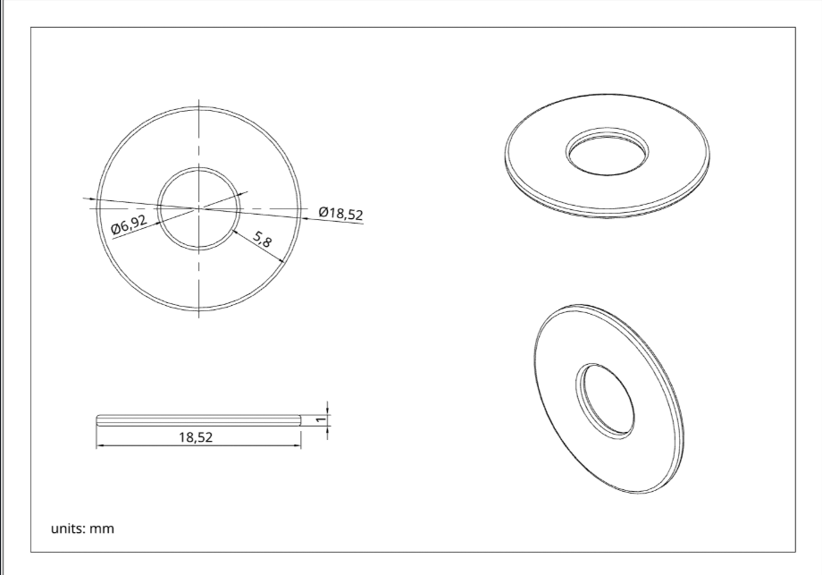  

**Description:**  
A real washer was measured and recreated as a 3D model with accurate dimensions.

**Key Learning:**  
- Precision modeling  
- Reading measurements  
- Converting real objects into CAD  

---

## 3. Light Switch Frame

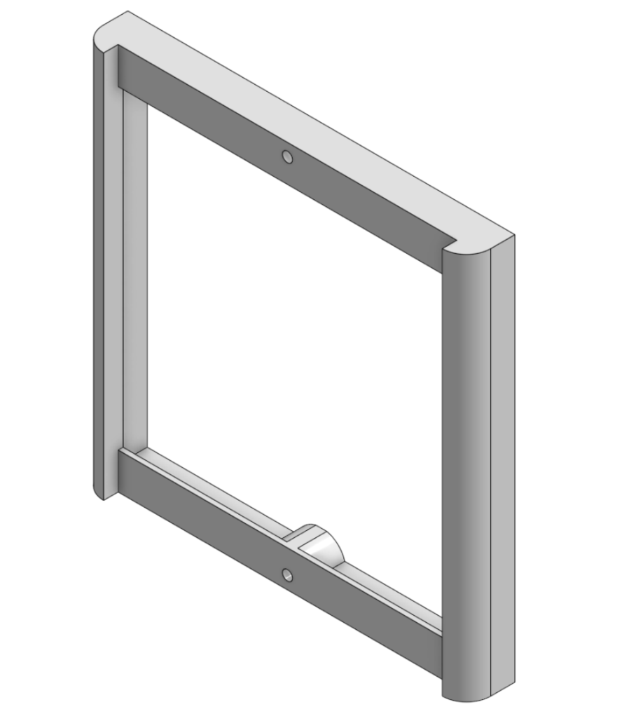  
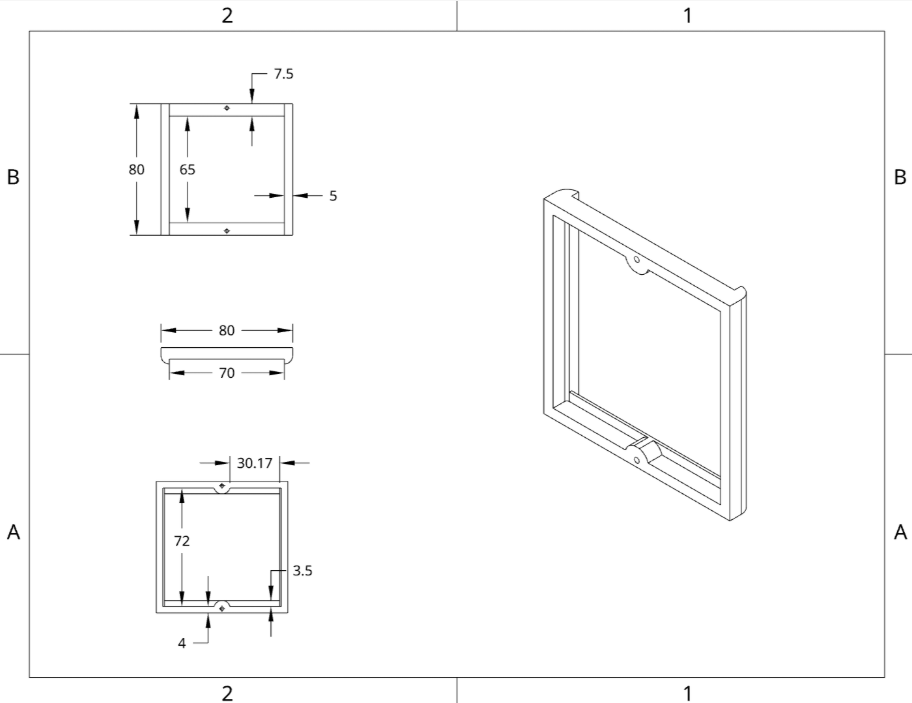  

**Description:**  
Designed a light switch frame based on real measurements and structure.

**Key Learning:**  
- Modeling complex shapes  
- Maintaining dimensional accuracy  
- Real-world design replication  

---

## 4. Servo Motor Holder

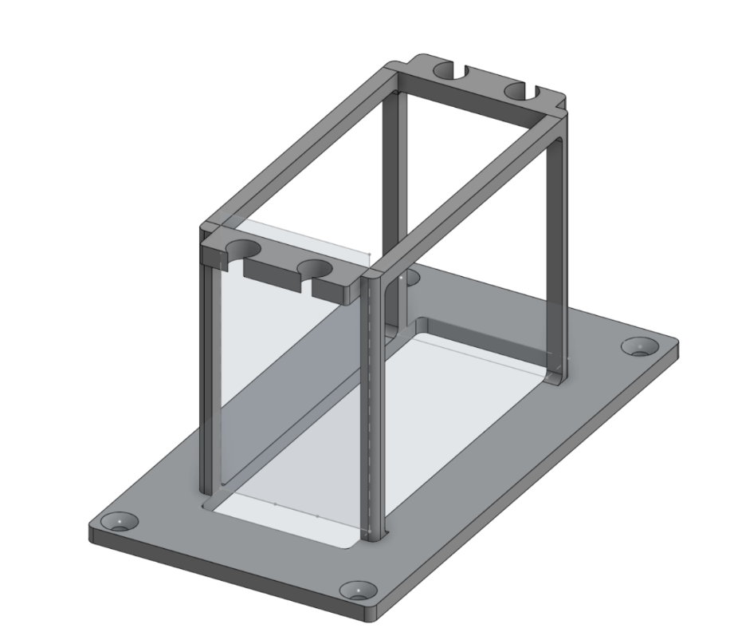  
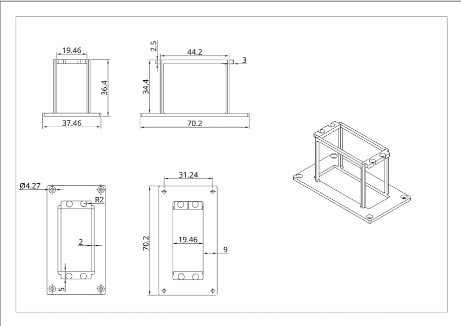  

**Description:**  
Designed a holder for a servo motor to ensure proper fitting and stability.

**Key Learning:**  
- Functional design  
- Mounting and alignment  
- Robotics component integration  

---

## 5. Robot Base

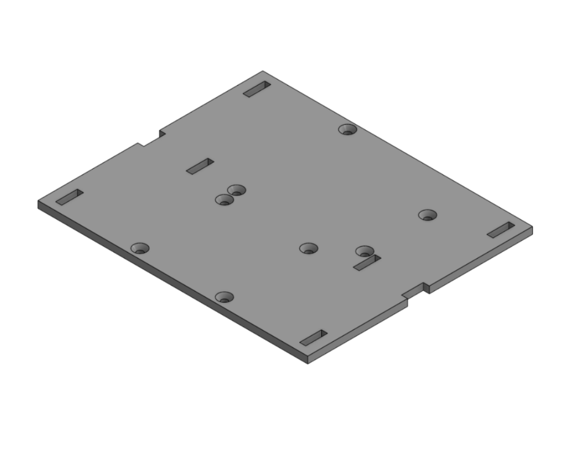

**Description:**  
A robot base was designed with mounting holes and slots for components.

**Key Learning:**  
- Structural design  
- Planning for assembly  
- Preparing models for fabrication  

---

## 6. Suspension System

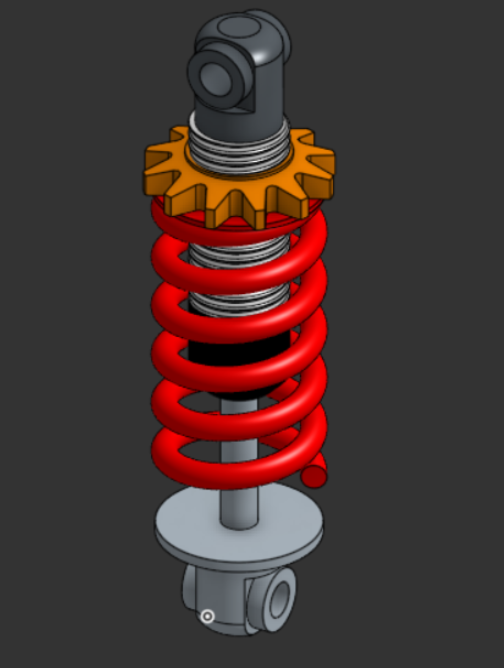

**Description:**  
Modeled a suspension system including spring and mechanical parts to understand motion and shock absorption.

**Key Learning:**  
- Mechanical assemblies  
- Spring behavior  
- Component interaction  

---

## 7. Forward Kinematics

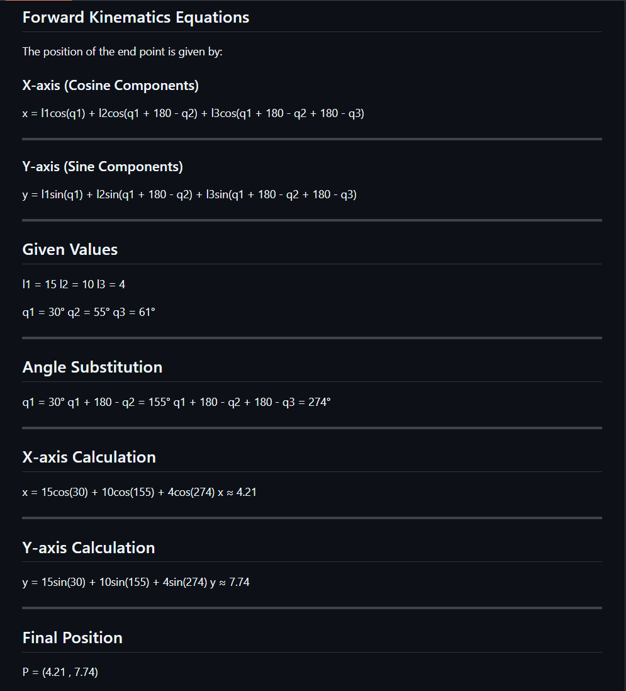

**Description:**  
Applied forward kinematics equations to calculate the position of the robotic arm end-effector.

**Key Learning:**  
- Relationship between angles and position  
- Using trigonometry in robotics  
- Motion analysis  

---

## 8. Planetary Gear System

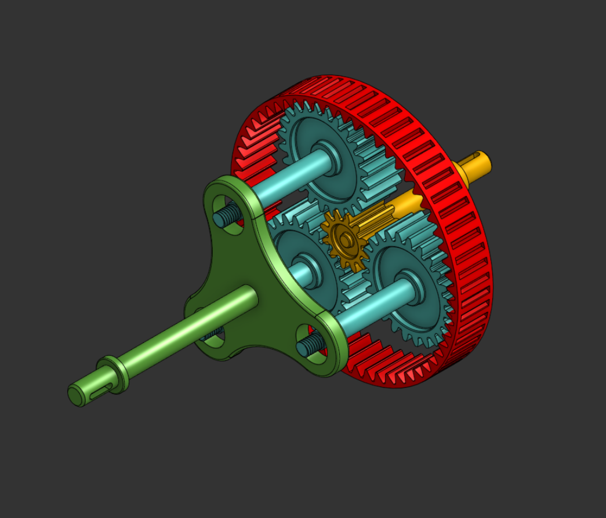  
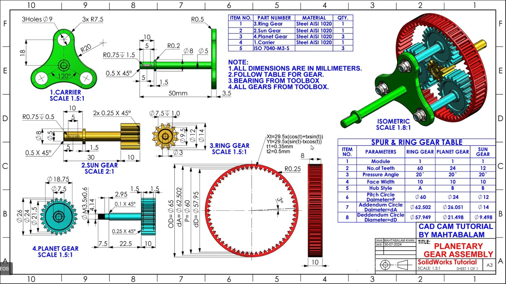

**Description:**  
Designed a full planetary gear system piece by piece and assembled it into a complete gearbox.

**Key Learning:**  
- Gear ratios and motion transfer  
- Assembly constraints  
- Mechanical system design
  
---

##  Additional Work

- Practiced robotic arm simulation using **Blender**  
- Improved control of movement and rotation  
- Worked on visualizing robot hand motion  

---

##  Tools Used

- Onshape (CAD Design)  
- Blender (Simulation)  
- GitHub (Documentation)  
