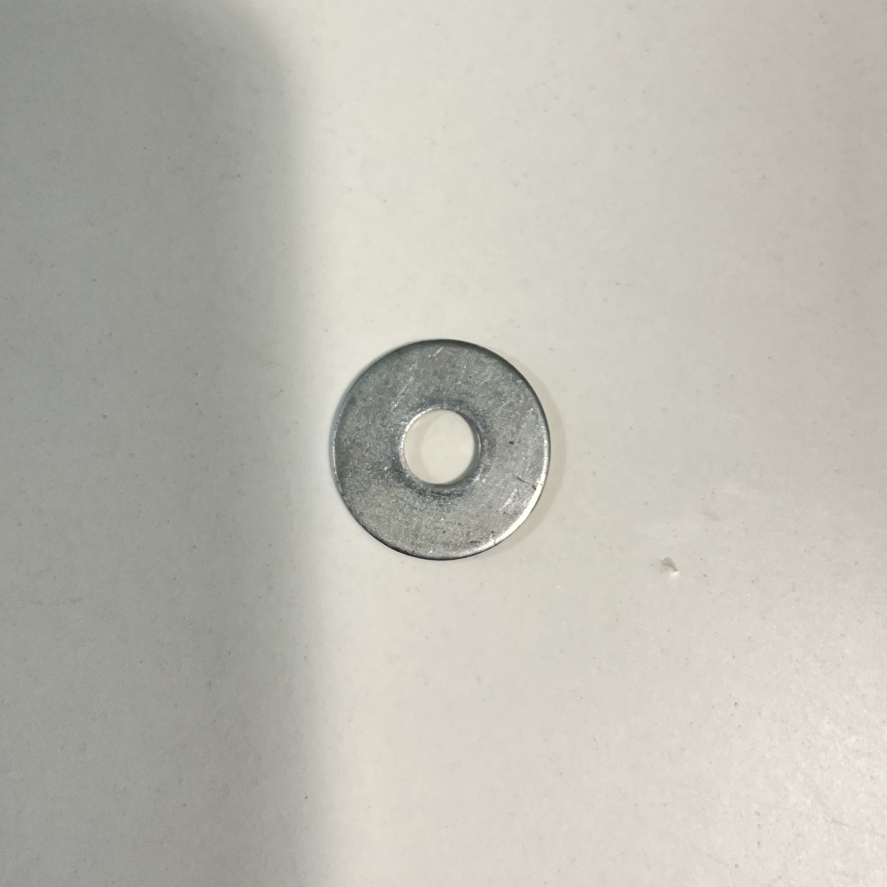
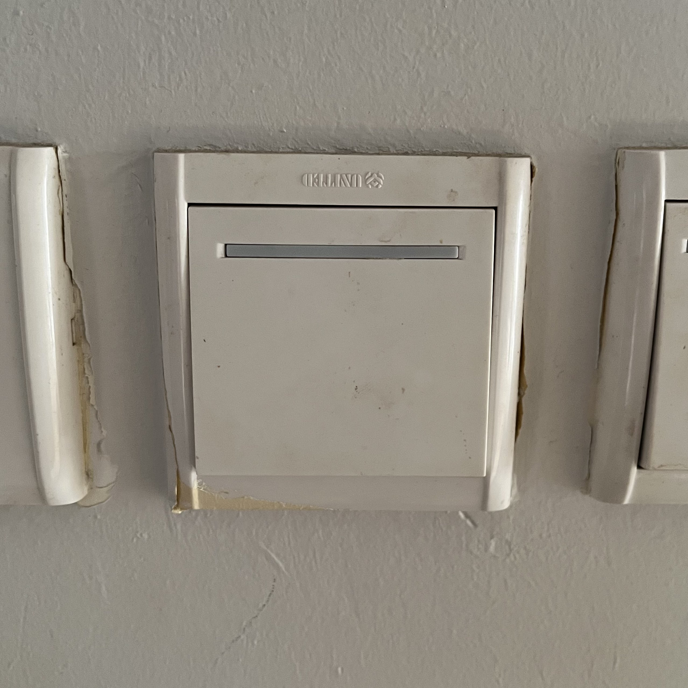
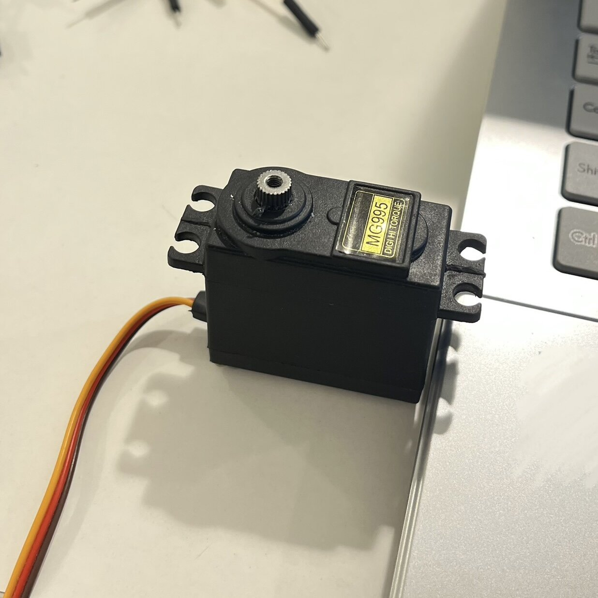

# Mechanical Engineering Training Projects

This repository includes all the mechanical design and robotics tasks I completed during my training.  
The work covers CAD modeling, real-world object design, assemblies, kinematics calculations, and gear systems.

---

## 1. I-Shape Design

**Description:**  
This was one of the first models I created to understand the basics of CAD design. I followed simple geometric references and focused on building the shape accurately using sketch and extrude tools. This helped me understand how to start any design from basic shapes.

**Key Learning:**  
- Using sketch and extrude tools  
- Understanding dimensions and proportions  
- Building clean and simple models

---

## 2. Flat Washer

  
  

**Description:**  
I selected a simple real-world object (washer) and measured it, then recreated it in CAD. The inspiration came from everyday objects, which helped me understand how to convert real dimensions into accurate digital models.

**Key Learning:**  
- Precision modeling  
- Reading measurements  
- Converting real objects into CAD  

---

## 3. Light Switch Frame

  
  

**Description:**  
This design was based on a real light switch frame. I observed the structure and measurements, then recreated it while focusing on details such as thickness, holes, and edges. This task helped me practice designing more detailed and realistic objects.

**Key Learning:**  
- Modeling complex shapes  
- Maintaining dimensional accuracy  
- Real-world design replication  

---

## 4. Servo Motor Holder

  
  

**Description:**  
This model was designed based on the need to hold a servo motor securely. I considered how the servo fits and how the holder should support it. The design was inspired by real mounting systems used in robotics.

**Key Learning:**  
- Functional design  
- Mounting and alignment  
- Robotics component integration  

---

## 5. Robot Base

**Description:**  
The robot base was designed by considering stability, size constraints, and component placement. The inspiration came from robot platforms, where proper hole placement and structure are important for assembly.

**Key Learning:**  
- Structural design  
- Planning for assembly  
- Preparing models for fabrication  

---

## 6. Suspension System

**Description:**  
This design represents a suspension system inspired by real mechanical systems used in vehicles. I focused on understanding how the spring works and how the parts connect together in an assembly.

**Key Learning:**  
- Mechanical assemblies  
- Spring behavior  
- Component interaction  

---

## 7. Forward Kinematics

**Description:**  
In this task, I applied forward kinematics equations to calculate the position of a robotic arm. The work was based on formulas provided during training, and it helped me understand how motion is calculated mathematically.

**Key Learning:**  
- Relationship between angles and position  
- Using trigonometry in robotics  
- Motion analysis  

---

## 8. Planetary Gear System

  

**Description:**  
This was a more advanced project where I designed a planetary gear system piece by piece and assembled it. The design was inspired by real gearbox systems, and I focused on how gears interact and transfer motion.

**Key Learning:**  
- Gear ratios and motion transfer  
- Assembly constraints  
- Mechanical system design
  
---

##  Additional Work

- Practiced robotic arm simulation using **Blender**  
- Improved control of movement and rotation  
- Worked on visualizing robot hand motion  

---

##  Tools Used

- Onshape (CAD Design)  
- Blender (Simulation)  
- GitHub (Documentation)  
